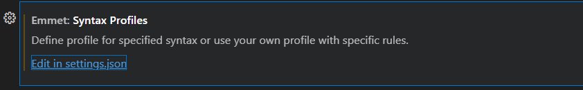
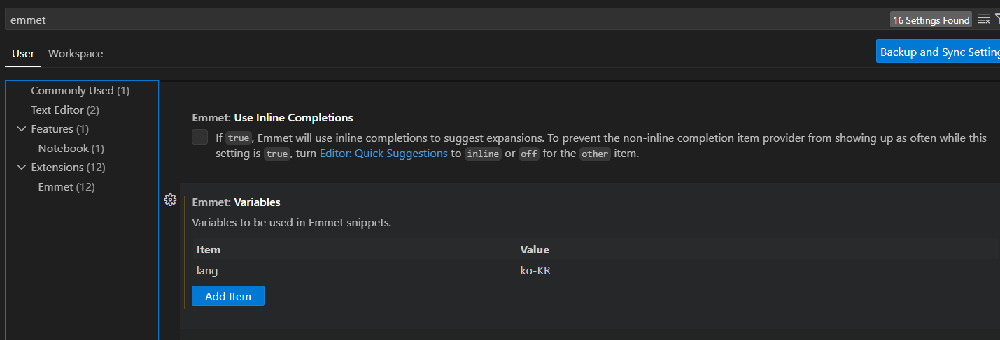

# HTML5의 역사

- W3C의 HTML4.01 = XHTML1.0
- W3C는 WHATWG의 표준을 받아들여 HTML5 탄생
- 인라인요소 블록요소
- Contents Model
  - HTML5는 Element별로 Category를 가지며, Category별로 규칙이 정의
  - [living standard](https://html.spec.whatwg.org/multipage/)
  - [a tag에 대한 표준](https://html.spec.whatwg.org/multipage/text-level-semantics.html#the-a-element)
- 아웃라인 알고리즘 - 정보 구조를 명확히 할 수 있도록 함
- SEO때문에 Semantic markup이 중요함
- API도 존재 함
- Tag는 일반 태그와 Empty Tag가 있음
    - React.js, Vue.js는 XHTML 문법을 따름
    - Empty Tag : "\<br/>"




- Tag는 속성을 가짐
    - "속성"="값"
- 속성은 값을 생략 가능한 논리 속성도 있음
- HTML5는 XHTML과 HTML4를 모두 호환
- NHN 코딩 컨벤션 [링크](https://nuli.navercorp.com/data/convention/NHN_Coding_Conventions_for_Markup_Languages.pdf)
- HTML의 종료태그 생략 X
- 속성의 값은 ""가 기본 javascript는 ''
- 동일 속성 중복 불가
- Character Entity Code로 변환하여 마크업 해야함. ex) &


---

## 개발 환경 설정
```
#1. degit install
npm install -g degit
#2. git repo 중첩구조 설정 시 사용
degit seulbinim/resources ./MULTI/assets
#3. live server local 설치
npm install live-server
```
- emmet 초기 설정


# CSS 수업

## 아토믹 디자인 패턴
- subAtomic - style, typography, color, 
- 원자
- 분자
- 조직체
- 템플릿
- 페이지

## 컴포넌트 드리븐 디벨롭

## CSS
- 스타일 초기화의 역사
  - RESET CSS
  - nomalize
  - moden reset css [링크](https://www.joshwcomeau.com/css/custom-css-reset/)
- 참고
  - [CSS 그림으로 비교](https://brunch.co.kr/@euid/2)
- CSS custom Property (CSS 변수)
- 웹폰트


## CSS 초기화
- index.css는 base, reset, theme에 의존한다.

## CSS box Model
- 가로, 세로 길이
- 경계선 : border
- 안쪽 여백 : padding
- 바깥 여백 : margin
- 실제 가로 세로 길이는 
  - margin + border + padding = content-box
  - border-box = border+padding
- box-sizing : content-box or border-box
- 요즘은 겨의 border-box를 씀 

---

## 작업 목록
- 환경 구성
- CSS 초기화
- 사용자 정의 속성(CSS Custom Property)
  - [MDN CSS 가장 좋은 레퍼런스](https://developer.mozilla.org/en-US/docs/Web/CSS/CSS_cascading_variables/Using_CSS_custom_properties)
  - :root : 
  - @property : 
  - -- : 
- lorem snippet 만들기
  - vscode Configure Snippet
- Figma Plugin을 이용해서 속성 추출하기
- CDD를 하려면 rem단위 혹은 em단위로 사용하는게 좋음
- darkmode
  - lightdark() 사용
  - @media 사용
- 웹폰트 추천
  - pretendard
  - suit
---


---

## 기타
- snippet 만드는 사이트
https://snippet-generator.app/?description=&tabtrigger=&snippet=&mode=vscode
- caniuse : html css javascript가 지원되는지 확인하는지 확인 [caniuse](https://caniuse.com/)
- [lightdark](https://developer.mozilla.org/en-US/docs/Web/CSS/color_value/light-dark) : 
