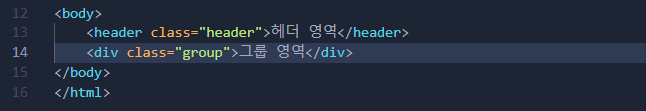

# 레이아웃

- WebPage 템플릿 초안 설계
  - 3단 설계 : header content footer
  - 4단 설계 : header nav content footer

## 실습 방향

- 최초 5단 설계
  - Header
  - Visual
  - Content
  - Slogan
  - Footer
- Wrapper or Container 설계
  - 전체 영역으로 확장된 경우 적용
- 높이값은 가급적이면 고정하지말고 auto로 설정하며, 최소높이 설정
- 정렬은 Flex Or Grid 적용하며 이를 위해 Wrapper 혹은 Container 필요
- 각 컴포넌트는
- normal page의 경우는 margin 트릭 사용
- 마크업을 잘못하면 Javascript 처리가 어려워질 수 있음
  - ex)Button, a를 div로 만들게되면 이벤트 처리가 어려워집니다.
  - ex)Button은 기본적인 속성등이 기 정의 되어있음
- 레이아웃 패턴 종류

  - Grid(가장 최신, Figma AutoLayout)

    - display: grid
    - Grid Item화되면 어떻게 되나요??
    - Grid 요소는 직계자식 요소만 적용 됨.
    - 그리드 단위는 1fr 프랙션..
    - 그리드는 라인 기반으로 설정함
    - 칼럼번호는 1번부터 시작
    - 행번호도 1번부터 시작
    - 하나의 셀을 표시하는 경우 Cell을 명시할 필요 없음
    - 2개 이상은 명시해야 함
    - grid에서도 변수를(template을) 이용하여 설정 가능
    - grid 사이의 공백은 Gap, Gutter 라고 함
    -

  - Flex(Figma AutoLayout )
    - flex는 row로 배치
    - 행간 정렬을 하려면 flex를 중첩으로 사용해야 함
    - row면 기준축이 가로, column이면 기준축이 세로
    - juesty는 메인축, align은 교차축
  - Margin
    - 모든 box는 block이거나 inline
    - block은 자리차지 1줄에 1개
    - inline은 1줄에 여러개
    - margin 트릭은 block box에만 사용

- 공통 컴포넌트 준비 작업
- 스니펫
- 프로젝트 구조 설정
- 헤딩
- 인풋컴포넌트

- 레이아웃 설계 => 마크업 => 스타일
- ## Application Template 설계

## 설계

### 전체 레이아웃 설계

### 컴포넌트 설계

---

## 앞으로 사용해야 할 TIP

- 단축키 사용 (emmet.io)

```html
#ul>li>a
<ul>
  <li><a href="./src/pages/main.html">메인 페이지</a></li>
</ul>
#header.header
<header class="header">헤더 영역</header>
#div.group
<div class="group">그룹 영역</div>
#div*5
<div class="page-title">메인 페이지</div>
<div class="sub-page">서브 페이지 1</div>
<div class="sub-page">서브 페이지 2</div>
<div class="sub-page">서브 페이지 3</div>
<div class="sub-page">서브 페이지 4</div>
#.main[role]
<div class="main" role="main">메인 콘텐츠 영역</div>
#.footer-container>.footer[role]
<div class="footer-container">
  <footer class="footer" role="contentinfo">푸터 영역</footer>
</div>
```

- snippet 사용
  

- 접근성
  
  
  
- Semantic Tag를 사용해야 접근성을 만족할 수 있음
- Role : 역할
- Properties : WAI-ARIA 속성
- States : 상태를 의미하는 정보값
- [WAI_ARIA 접근성 예제](https://www.w3.org/WAI/ARIA/apg/patterns/dialog-modal/examples/dialog/)
- Aria Semantic Tag 사용 예제

```
    <header class="header">헤더 영역</header>
    <div class="header" role="header">헤더 영역</div>

    <main>
```

- Prettier 세팅
  
  
  
  

- Github에 배포하는 경우 절대경로만 인식함

- [Using CSS Nesting](https://developer.mozilla.org/ko/docs/Web/CSS/CSS_nesting/Using_CSS_nesting)

- [CSS Flex](https://studiomeal.com/archives/197)
